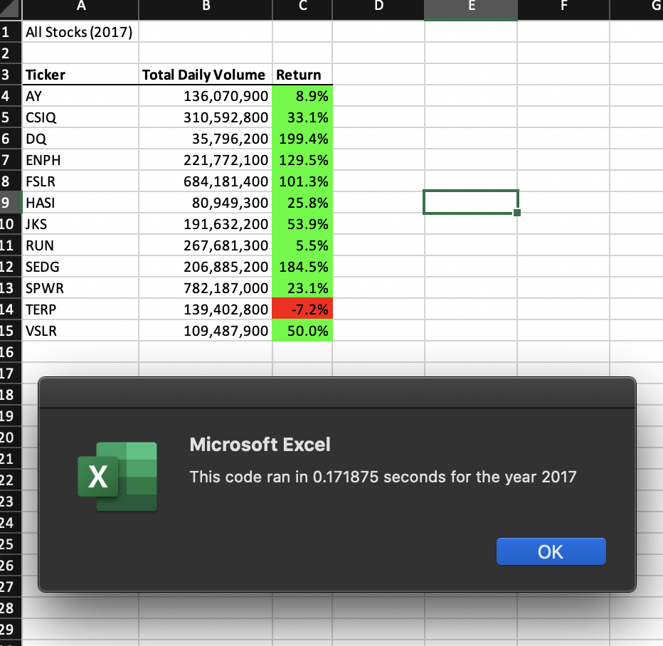
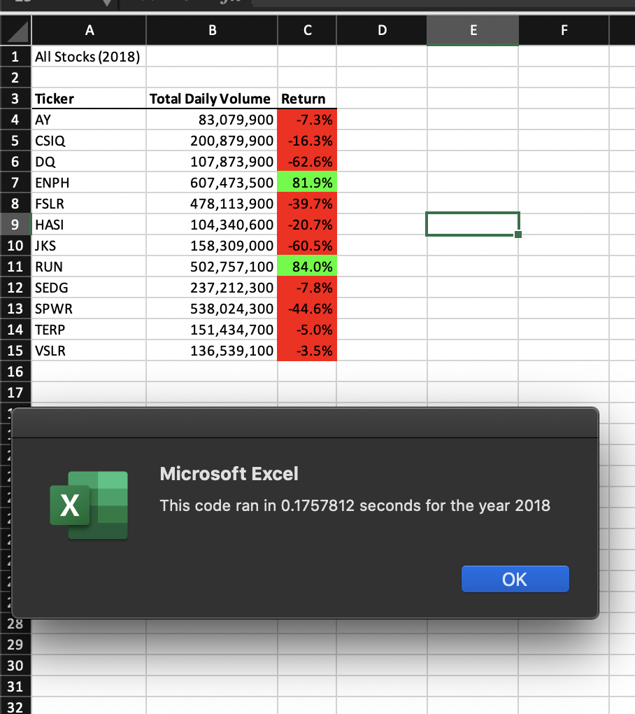

# stock-analysis
Analysis green_stock data VBA
## Overview of Project

### Background
#### The green stocks dataset includes information on green energy companies' stocks that is needing to be analyzed in order to see which stocks are the smartest to invest in, with positive return rates versus those with negative return rates. We are using the data to output a worksheet for any given years' information on the stocks with the information condensed into the Ticker's name, the Total Daily Volume, and the Return rate in order to better visualize the worthwhile stocks to invest in. 

### Purpose
#### The purpose of this analysis is to provide a method of analyzing the stock market's fluctuations in order to be able to make the smartest choice when investing. We want to execute an analysis VBA that will be productive, therefore it will be a refactor version, that way it will execute faster and we can recieve our results sooner.  We want to be able to, we used the dataset to create an analysis on any given year that returns the a table in a workbook including the stock's correlating Ticker, Total Daily Volume, and Return. 

## Results

#### Shown in the images above we see that in a general sense, the stock performance in 2017 was a lot better than the stock performance in 2018. In particular AY, CSIQ, DQ, FLSR, HASI, JSK, SEDG, SPWR, VSLR all went form positive return rates to negative return rates from 2017 to 2018. We also find that TERP remained in the negatives for return rates, and ENPH and RUN remained in the positives for return rates. Thus the stocks that seem to have the most benefits while invested would be RUN and TERP for these two particular years. The execution of this workbook for stocks in 2017 was done in 0.171875 seconds and the execution for this workbook for stock in 2018 was done in 0.1757812 seconds. This speed is welcomed by the refactoring of the original All Stocks Analysis code. When running the All Stocks Analysis code it ran for 2017 in 0.5898438 seconds and for 2018 it ran in 0.59375 for the same resulting workbooks as the refactored code's output. 

###Summary
#### The pros of refactoring include a faster execution, which gives us our results in a more timely manner, this occurs because we are taking less steps to create the desired output. Refactoring can also catch bugs that are in original codes in order to execute correctly, this is because when refactoring you can find errors and simpler ways to code things that original versions. It also can improve the structure of the design of the code to have a more fluid read. A cons that come with refactoring a code is that it becomes a risk factor when not refactored correctly, causing bugs to arise and an incorrect execution.  Another con would be if looping through the data multiple times automatically fixes bugs that could occur. 
For this particular dataset, refactoring the code improved the speed of execution while providing the same output. The con that could apply to the VBA analysis would be that if the loop through the data multiple times debugged any potential threats to the execution, but we see that the refactored version of this code does not run into bugs with only having a single loop.  
